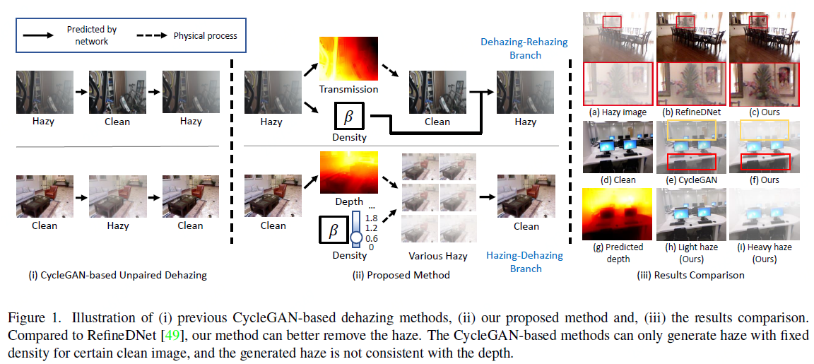

# D4 and Variations
===============================================
This is an extension on the the PyTorch implementation of the paper 'Self-augmented Unpaired Image Dehazing via Density and Depth Decomposition', which is accepted by CVPR-2022. 

Introduction
---------------------------------
In this paper, the Authors suggest a framework called D4 (Dehazing via Decomposing transmission map into Density and Depth) for making and getting rid of haze. Instead of just estimating transmission maps or clean content, the suggested framework looks at the scattering coefficient and depth information in both hazy and clean images. With an estimate of the scene depth, their method can re-render hazy pictures with different thicknesses, which helps train the dehazing network even more. It's important to note that the whole training process only needs unpaired hazy and clean pictures, but the scattering coefficient, depth map, and clean content were all reconstructed from a single hazy image. Extensive tests show that our method is better than current unpaired dehazing methods, even though it uses a lot fewer factors and FLOPs.




Run Using Jupyter / Colab Notebook
---------------------------------
Upload the provided Jupyter Notebook to Colab, connect to their GPU and run all the cells to reproduce all the results. 

Refer to the below instructions in case you want to run the code locally without using Jupyter notebook or Google Colab.


Prerequisites
---------------------------------
* Python 3.7
* Pytorch 1.7.1
* NVIDIA GPU + CUDA cuDNN

Datasets
---------------------------------
### 1.Testing
I used [SOTS-outdoor](https://sites.google.com/view/reside-dehaze-datasets/reside-standard) Dataset for testing.  

After downloading the dataset, please use scripts/flist.py to generate the file lists. For example, to generate the training set file list on the SOTS-indoor testset, you should run:

```
python scripts/flist.py --path path_to_SOTS_outdoor_hazy_path --output ./datasets/sots_test_hazy_outdoor.flist
```

And then fill the path of ground truth images in the config file.

Please notice that the ground truth images of SOTS-indoor have additional white border, you can crop it first.

### 2.Training 
For training, I used [SOTS-Indoor](https://sites.google.com/view/reside-dehaze-datasets/reside-standard) dataset, you can follow the operations above to generate the training file lists.

```
python scripts/flist.py --path sots_train_hazy_path --output ./datasets/sots_train_hazy.flist
python scripts/flist.py --path sots_train_gt_path --output ./datasets/sots_train_gt.flist
```

Getting Started
--------------------------------------
To use the pre-trained models, download it from the following link then copy it to the corresponding checkpoints folder, like `./checkpoints/quick_test`

[Pretrained model](https://drive.google.com/file/d/1KLvPdNpskdVDSz0qEIP_tn-j2MwTcJAV/view?usp=sharing)

### 0.Quick Testing
To hold a quick-testing of our dehazing model, download our pre-trained model and put it into `checkpoints/quick_test`, then run:
```
python3 test.py --model 1 --checkpoints ./checkpoints/quick_test
```
and check the results in 'checkpoints/quick_test/results'

If you want to see the depth estimation and haze generation results, change the `TEST_MODE` term from `pair_test` to `clean`, then run the same command.  

### 1.Training
1)Prepare the SOTS-indoor training datasets following the operations in the Dataset part.
2)Add a config file 'config.yml' in your checkpoints folder. We provide an example checkpoints folder and config file in `./checkpoints/train_example` 
3)Train the model, for example:

```
python train.py --model 1 --checkpoints ./checkpoints/train_example
```

### 2. Testing
1)Prepare the testing datasets following the operations in the Dataset part.
2)Put the trained weight in the checkpoint folder 
2)Add a config file 'config.yml' in your checkpoints folder. We provide an example checkpoints folder and config file in `./checkpoints/test_example`
3)Test the model, for example:
```
python test.py --model 1 --checkpoints ./checkpoints/test_example
```


Citation
--------------------------------------
We have referred to the below Research Paper and Implementations:
```
@inproceedings{yang2022self,
  title={Self-Augmented Unpaired Image Dehazing via Density and Depth Decomposition},
  author={Yang, Yang and Wang, Chaoyue and Liu, Risheng and Zhang, Lin and Guo, Xiaojie and Tao, Dacheng},
  booktitle={Proceedings of the IEEE/CVF Conference on Computer Vision and Pattern Recognition},
  pages={2037--2046},
  year={2022}
}
```

